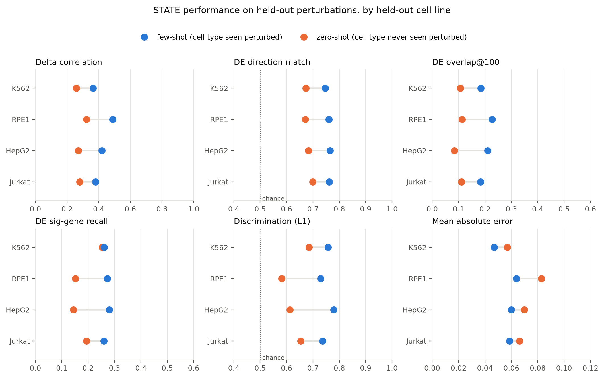
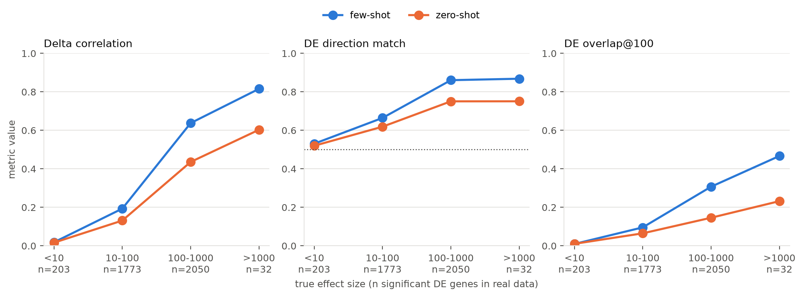

# Arc Virtual Cell Challenge 2026

Predicting single-cell expression responses to CRISPRi knockdowns in cell
contexts with no perturbation training data. Beyond the leaderboard, the
question this repo is organized around: **when do perturbation-response
predictions transfer to a new cell context, and do the challenge metrics
detect it when they fail?**

Running results and per-experiment notes are in [RESULTS.md](RESULTS.md).
The write-up in progress is [REPORT.md](REPORT.md).

## Results so far

**Leaderboard (validation contexts A/B/C).** Three submissions, each adding
one ingredient to the last:

| Model | What it asserts | Overall | Rank |
|---|---|---|---|
| predict-no-change | knockdowns do nothing | -0.304 | 568 |
| target-knockdown | only the target gene drops | -0.299 | 552 |
| global-mean-effect | K562's measured effects apply to every context | **+0.058** | **265** |

The lookup table (no learning, context-blind) sits mid-field. Between the
first two submissions we established that the DE metrics exclude the target
gene and that the server's raw-error metric is pinned at 0 across radically
different predictions.

**Zero-shot vs few-shot degradation** (`degradation_analysis.py`,
`make_figures.py`), computed from Arc's published paired STATE runs on four
cell lines:





- Removing the target cell type from training degrades every effect-level
  metric consistently (direction accuracy ~0.76 -> ~0.68, DE overlap roughly
  halved) but predictions stay well above chance.
- Below ~10 significant DE genes, nothing is predictable in either regime;
  utility starts above ~100, and that is where the zero-shot cost lands.
- Mean absolute error barely moves under the same regime change. Raw
  expression-error metrics do not see this failure; DE-level metrics do.

**Other findings.** The challenge's 300 perturbations have zero overlap with
every essential-gene Perturb-seq dataset and are covered only by the
genome-wide K562 screen (272/300). The anonymized contexts match Jurkat (A),
HeLa (B) and CAL-33 (C) by pseudobulk correlation against DepMap
(`identify_contexts.py --depmap`). Cross-line effect conservation in Jiang
2025 is bimodal (`jiang_transfer.py`). Training STATE from scratch at
consumer-GPU budgets failed to fit even its training data (documented in
RESULTS.md); the local evaluation pipeline was verified by reproducing Arc's
published Jurkat few-shot score with their checkpoint (0.377 vs 0.381).

## Work in progress

- Fine-tuning Arc's pretrained ST-HVG-Replogle checkpoint on the genome-wide
  K562 data restricted to the 272 challenge perturbations
  (`prepare_finetune_data.py`, `subsample_finetune_data.py`,
  `configs/finetune_v3.toml`). Two earlier attempts failed from
  perturbation-embedding under-exposure; the current run gives each
  perturbation ~2,000 training examples.
- If that model reproduces known K562 effects, a fourth submission: model-
  predicted per-context shifts applied to resampled control cells through
  the same harness as the baselines.
- Planned: ensembling with the signature lookup, context-aware scaling of
  borrowed effects, adding Nadig Jurkat data (context A's cell type), and the
  report.

## Setup

Requires [uv](https://docs.astral.sh/uv/) and, for STATE, `uv tool install arc-state`
(with a CUDA torch build; see notes in RESULTS.md).

```bash
uv sync
uv run vcc login --token-stdin   # token from the challenge site's Credentials page
uv run vcc datasets download controls -o /path/to/vcc_data/vcc_2026_controls.zip
```

Keep data outside the repo. The scripts default to a `controls/` directory
(a junction or symlink to the unzipped bundle works).

## Workflow

```bash
# inspect the bundle and the sparsity budget
uv run python explore.py

# baselines (all share the build_chunk interface in baseline_submit.py)
uv run python baseline_submit.py --model no-change  --out prediction.h5ad
uv run python baseline_submit.py --model target-kd  --out prediction_kd.h5ad
uv run python compute_signatures.py --bulk <K562_gwps_raw_bulk.h5ad> --out signatures.h5ad
uv run python baseline_submit.py --model global-mean --signatures signatures.h5ad --out prediction_gm.h5ad

# validate locally, then package and submit
uv run vcc prep prediction_gm.h5ad -g controls/gene_names.csv --perts controls/pert_counts.csv -o prediction_gm.vcc --dry-run
uv run vcc submit prediction_gm.vcc -m "global-mean-effect"

# analyses and figures
uv run python identify_contexts.py --depmap
uv run python jiang_transfer.py
uv run python degradation_analysis.py [--stratify]
uv run python make_figures.py
```

`--n-perts 5` on `baseline_submit.py` builds a smoke-test file (not a valid
submission) in about a minute; `vcc prep --dry-run` on it should complain
only about the perturbation count.

## Repository map

| File | Purpose |
|---|---|
| `explore.py` | shapes, depth, sparsity, gene-order check, projected submission size |
| `baseline_submit.py` | chunked submission builder; models: no-change, target-kd, global-mean |
| `compute_signatures.py` | per-perturbation log2FC signatures from Replogle pseudobulk |
| `identify_contexts.py` | pseudobulk matching of contexts to reference lines / DepMap |
| `jiang_transfer.py` | cross-line effect conservation in Jiang 2025 |
| `degradation_analysis.py` | fewshot-vs-zeroshot pairing and effect-size stratification |
| `make_figures.py` | regenerates `figures/` |
| `prepare_training_data.py`, `make_split_configs.py` | harmonized 5-context corpus and paired split TOMLs for STATE |
| `prepare_finetune_data.py`, `subsample_finetune_data.py` | data in the pretrained checkpoint's 2,000-HVG representation |
| `configs/` | cell-load TOMLs for every training/eval run |

## Data sources

| Source | Cell lines | Challenge-panel coverage |
|---|---|---|
| Replogle 2022 (Figshare 20029387), genome-wide | K562 | 272/300 |
| Replogle 2022, essential panels | K562, RPE1 | 0/300 |
| Nadig 2025 (GEO GSE264667) | HepG2, Jurkat | 0/300 |
| VCC 2025 training set | H1 hESC | 13/300 |
| Jiang 2025 (Zenodo 14518762) | A549, BxPC-3, HAP1, HT-29, K562, MCF7 | 9/300 |
| DepMap 24Q4 | 1,673 lines (bulk) | reference for context identification |
| Arc ST-HVG-Replogle (HuggingFace) | checkpoints + paired eval outputs | source of Figures 1-2 |

## Limitations

- The degradation figures reuse Arc's published runs; they are not an
  independent replication of the training.
- One model family, one holdout design (the essential-gene panel).
- Context identities are transcriptional matches, not genotype-verified.
- Leaderboard results are on validation contexts only; the final test
  (Oct 22) uses different lines and perturbations.
